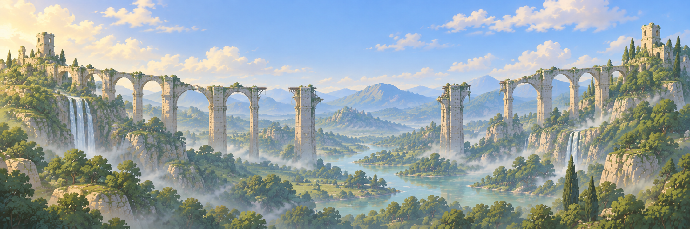

# Glue — «Держись!»

Кооперативный 2D-платформер-головоломка для **2–4 игроков** на Godot. Игроки бегают, прыгают, хватаются друг за друга и превращаются в платформы. Из этих действий возникают цепи, маятники, живые лестницы, противовесы и катапульты.

> Каждый уровень и каждый его участок сначала должен быть полностью проходим **двумя игроками**. После этого проверяется прохождение втроём и вчетвером.

## Текущее состояние

Подготовлены проектная документация, план первого мира «Забытые мосты» на **20 уровней** с нарастающей сложностью (решение 01.10.2026) и десять задников v1. Есть серый прототип этапа 1 на Godot 4.7: подключение игроков с геймпадов, бег, прыжок, стояние друг на друге, общая камера, общий чекпоинт; гибель одного — общий респавн команды через 1 с; края кадра — невидимые стены. Этап 2 в работе: готовы «Замри» (платформа и якорь, в том числе в воздухе) и хват (висение, маятник, цепи, прыжок с хвата на голову товарищу). Готовы вытягивание товарища за руку, наклон замершего и катапульта. Первый технический рубеж пройден на клавиатурах. Этап 3 в работе: собрана физическая песочница `levels/sandbox.tscn` с весом, ящиками (обычный и тяжёлый), нажимными плитами и защёлками, дверями, выдвижным мостом, качелями и пропастью. При общем респавне механизмы возвращаются к состоянию чекпоинта; песочница проверена руками. Этап 4 закрыт: серые уровни 01 «Первые шаги», 02 «Подставь плечо», 03 «Не отпускай» пройдены руками. Этап 5: собраны серые уровни 04–10 — «Ступенька в воздухе», «Катапульта», «Ящик», «Удерживай!», «Тяжёлый груз», «Живая лестница», «Перевал». Игра начинается с меню выбора уровня: уровни открываются по прохождению, прогресс сохраняется. В паузе (Start или Esc) есть рестарт с чекпоинта. Автотест проходит каждый уровень вдвоём от старта до двери. Ручной плейтест 04–10 пройден. Этап 6 (визуальный прототип) собран: персонаж v2 из Blender, механизмы, платформы одеты текстурами (кладка, скала, мох, край с плющом), задники v2 с ориентиром на каждом из 10 уровней. Оформление пользователь проверил и принял. Этап 7: новые механизмы — ключ и замок, крюк, подъёмник, рычаг, фиксатор качелей, обратная дверь; опасности — шипы, пила, призрак-стесняшка; анимация гибели «желе лопнуло». Собраны уровни 11 «Качели», 12 «Бросок качелей», 13 «Подъёмник» (бот проходит все три) и черновик 14 «Цепь» (крюки и шипы, бот доводится). План — шесть миров по 20 уровней ([10](docs/10_миры_опасности_враги.md)); дальше — уровни 14–20 с призраком и задание на графику ([09](docs/09_графика_11-20_задание.md), [что где](docs/05_этапы_разработки.md)).

### Запуск прототипа

1. Положить Godot 4.7 stable win64 в `tools/godot/` (папка не хранится в git).
2. Запустить `run_prototype.bat`.
3. В меню выбора уровня каждый игрок нажимает **A** на своём геймпаде, затем выбирает уровень (стик или крестовина, **A** — играть). Геймпад: A — прыжок, X/LB — замри, RB/RT (держать) — хват. Без геймпадов: игрок 1 — A/D, W, S, E; игрок 2 — стрелки, ↑, ↓, «.» или Num0. Полная таблица — в [правилах](docs/01_правила_игры.md).

Автономный exe: `build_exe.bat` собирает `build/windows/Glue.exe` — один файл, запускается на любом Windows x64 без Godot. Нужны шаблоны экспорта Godot 4.7 в `%APPDATA%\Godot\export_templates\4.7.stable\`. Папка `build/` не хранится в git.

Автотесты: `tools\godot\Godot_v4.7-stable_win64_console.exe --headless --path . res://tests/stage1_smoke.tscn` (и `stage2_smoke.tscn` … `stage5_smoke.tscn`, `stage7_smoke.tscn`, `stage7_levels_smoke.tscn`, `hazards_smoke.tscn`, `menu_smoke.tscn`). Превью уровней в PNG: `tests/preview.tscn` (как запускать — в шапке `tests/preview.gd`). В игре: Start или Esc — пауза (рестарт с чекпоинта, выбор уровня); F2 — следующий уровень, F3 — персонажи или серые прямоугольники с хитбоксом, F5 — заново; в меню F9 открывает все уровни для отладки.

Графика (этап 6): персонаж — `tools/blender/character.py` → `assets/characters/v2/` ([как устроено](docs/03_визуал_и_производство.md#персонаж-v2-02102026--правка-дефектов-v1)); механизмы — `tools/blender/props.py`; платформы — `src/level/ground.gd` с текстурами из `tools/blender/make_tiles.py` ([как устроено](docs/03_визуал_и_производство.md#платформы-02102026)); задники — `levels/backdrops/` и слой `Landmark` в каждом уровне.

## Материалы

- [Проектная база и оглавление](docs/README.md)
- [Первый мир: 20 уровней](docs/02_забытые_мосты_уровни.md)
- [Визуал и производство графики](docs/03_визуал_и_производство.md)
- [Архитектура Godot](docs/04_godot_архитектура.md)
- [Этапы разработки](docs/05_этапы_разработки.md)
- [Параметры, формулы и история решений](docs/06_параметры_и_решения.md)
- [Десять задников: файлы и размеры](assets/backgrounds/world_01/v1/README.md)
- [Запросы генерации изображений](assets/backgrounds/world_01/v1/PROMPTS.md)

Для просмотра локальной галереи открыть `assets/backgrounds/world_01/v1/index.html` в браузере после скачивания репозитория. PNG являются цельными фоновыми композициями; игровые объекты и коллизии добавляются отдельно.

## Организация

`docs/` хранит правила, решения и планы разработки. `assets/backgrounds/world_01/v1/` содержит первую версию фоновых ассетов, каталог, исходные запросы и manifest с размерами и контрольными суммами.

Новые визуальные версии сохраняются рядом с предыдущими. Изменения дизайна и измеренные параметры фиксируются в документации. Целевой вид игры — концепт-лист [docs/референсы/reference.png](docs/референсы/reference.png). Задники v1 по стилю от него отличаются; для визуального этапа нужен набор v2.

Игра только локальная: 2–4 игрока за одним экраном, основное управление — геймпады.

